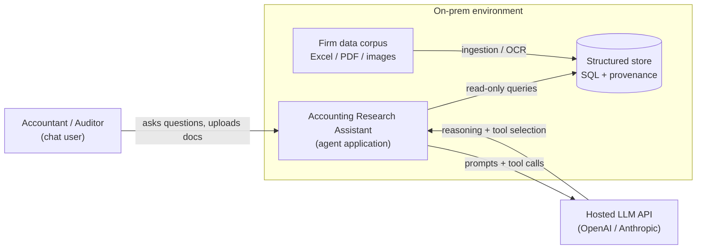
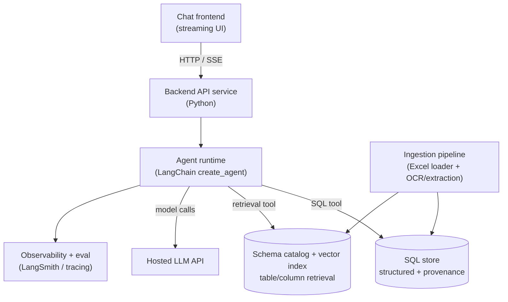
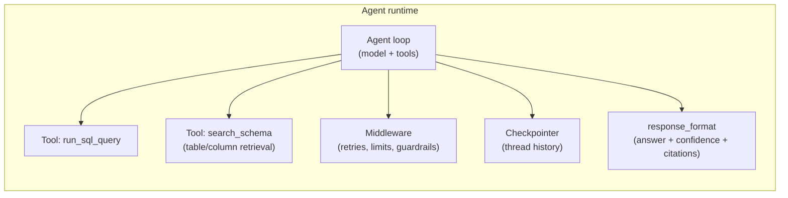
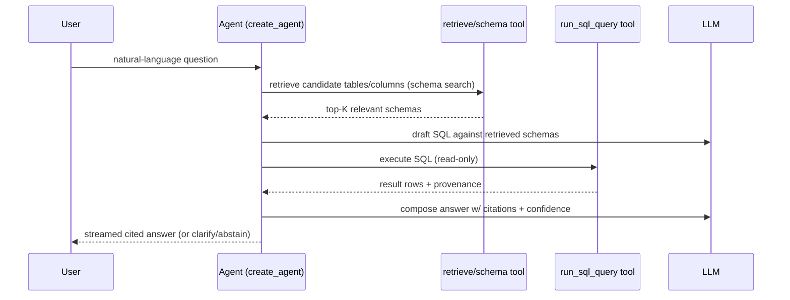
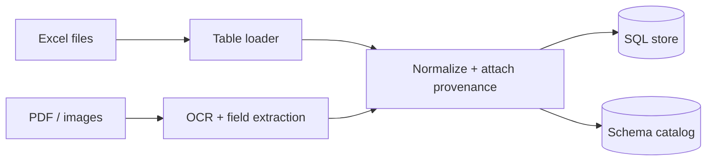

# TDD — Accounting Research Assistant (AI Agent)

- **Author:** _TBD_
- **Date:** _TBD_
- **Status:** Draft
- **Related:** `PRD.md` (product requirements — the "what/why" this design implements)

> This Technical Design Document describes **how** the Accounting Research Assistant is built.
> It takes the problem, users, goals, scope, and behavioral requirements from the PRD as given and
> does not restate them. Where a design choice exists to satisfy a specific PRD outcome, that
> outcome is named so the choice stays traceable.

---

## 1. Overview & Context

### 1.1 Requirements this design must satisfy
Derived from the PRD (not re-argued here):

- **Accuracy is the #1 constraint** — answers must be correct and verifiable; the system must
  prefer abstaining/clarifying over guessing.
- **Traceability** — every quantitative answer must carry source provenance (file / sheet / row /
  document) an auditor can check.
- **Latency** — ≤ ~10s per answer (perceived latency may be improved via streaming).
- **Read-only** — the agent never mutates the underlying data.
- **Deployment** — application and data run **on-prem**; the LLM is a **hosted model API**.
- **Inputs** — structured tables (Excel), PDFs, and images (invoices); thousands of tables,
  hundreds of rows/cols each, growing over time; plus ad-hoc user uploads.
- **Extensibility** — single-firm MVP, but data model and services should not preclude future
  multi-tenancy and per-user/per-client permissions.

### 1.2 System context (C4 L1)



---

## 2. Architecture

### 2.1 Container view (C4 L2)



- **Chat frontend** — thin UI; renders streamed tokens, citations, and a confidence indicator.
- **Backend API** — session/auth, request handling, invokes the agent runtime.
- **Agent runtime** — the LangChain `create_agent` harness (Section 3).
- **SQL store** — canonical structured data with provenance; the source of exact numeric answers.
- **Schema catalog + vector index** — searchable index of table/column metadata used to select the
  few relevant tables per query (essential at thousands-of-tables scale). Holds metadata only, never
  numeric answers.
- **Ingestion pipeline** — loads the existing corpus and processes uploads (OCR + extraction), and
  builds/updates the schema catalog.
- **Observability/eval** — tracing and evaluation of agent runs.

### 2.2 Component view (C4 L3)



---

## 3. Agent Design

Structured by the three agentic layers: **Workflow**, **Capability**, **Production**.

### 3.1 Workflow layer — the agent loop

- Built on LangChain's current **`create_agent`** harness
  (https://docs.langchain.com/oss/python/langchain/agents) — model-calls-tools-in-a-loop. Build
  against this modern API, not legacy chain/agent patterns.
- **Pattern:** single planner-executor agent (no multi-agent decomposition for the MVP; add only if
  evaluation shows it's justified).
- **Stopping condition:** the agent stops when it has a grounded, cited answer or determines it must
  clarify/abstain.

Typical query flow:



### 3.2 Capability layer — tools, retrieval, memory, output

**Tools** (`@tool`), with descriptions written carefully (agents select tools by description):

- **`run_sql_query`** — executes a **read-only** SQL query against the structured store and returns
  rows **with provenance columns**. Read-only enforced at the DB layer (see 4.4).
  - Input: `sql: str` (or a constrained query object — see ADR-004).
  - Output: rows + per-row provenance (`source_file`, `sheet_or_page`, `row_id`).
- **`search_schema`** — given the question, returns the **few candidate tables/columns** most likely
  relevant, from the schema catalog (4.2). Required at thousands-of-tables scale: the model never
  sees the full schema, only the retrieved subset it needs to write SQL. Returns table/column names
  + descriptions (metadata, not row data).

**Schema retrieval strategy (table selection).** With thousands of tables, selecting the right ones
is the single largest accuracy lever, so it is a first-class step, not an afterthought:
- **Index** table/column metadata in the schema catalog (4.2): names, human/LLM-authored
  descriptions, and representative sample values.
- **Retrieve** the top-K candidate tables per query using **hybrid search** (semantic embeddings +
  keyword/BM25) to handle both business-term synonyms (e.g., "travel" vs. "T&E") and cryptic column
  names.
- **Two-stage** when the schema is large: first select candidate tables, then the relevant columns
  within them.
- **On low retrieval confidence** (nothing clearly relevant), the agent asks a clarifying question
  or abstains rather than guessing a table — consistent with the failure policy (3.3).

**Query strategy:** all answers are produced by SQL over the structured store; retrieval is used
only to select the right tables/columns, not to answer. Arithmetic/aggregation always runs in SQL,
never LLM estimation (satisfies the accuracy requirement).

**Memory & state:** multi-turn history via a **checkpointer + `thread_id`** (one thread per
conversation). Locally use `InMemorySaver`; production uses a persistent checkpointer.

**Structured output** (`response_format=` Pydantic) so every answer is machine-checkable:

```python
class Citation(BaseModel):
    source_file: str
    locator: str          # sheet!range, page, row id, etc.
    snippet: str | None = None

class AgentAnswer(BaseModel):
    answer: str
    confidence: float                 # 0..1 overall confidence
    abstained: bool                   # True when the agent declined to answer
    reason: str | None = None         # why it abstained / needs clarification
    citations: list[Citation] = []
    sql_used: str | None = None       # the query executed (for traceability/eval)
```

### 3.3 Production layer — guardrails & observability

**Middleware** (enforcement that must be deterministic, regardless of model output):

| Middleware | Purpose |
|---|---|
| `ModelRetryMiddleware` | Retry transient model/API failures (keep retries/delays small to protect the ≤10s budget). |
| `ToolRetryMiddleware` | Retry transient tool/DB failures. |
| `ToolErrorMiddleware` | Convert tool errors (e.g., malformed SQL) into messages the model can see and self-correct. |
| `ModelCallLimitMiddleware` | Cap model calls per run to prevent runaway loops and control cost/latency. |
| `ToolCallLimitMiddleware` | Cap tool calls per run (e.g., number of SQL executions). |
| `PIIMiddleware` | Content controls (detect / redact / mask) for sensitive fields. |
| Custom middleware | Enforce read-only, cap query result rows, and treat document/OCR text as **data, not instructions** (prompt-injection defense). |

Compose ordering: place `ToolRetryMiddleware` inner (before `ToolErrorMiddleware`) so exceptions
reach the error handler only after retries are exhausted.

**Failure handling & fallbacks.** Every failure mode funnels into one consistent terminal
fallback — **graceful abstention** (a clear "I couldn't answer, and why"), never a fabricated
answer (satisfies the accuracy requirement). What differs is what is attempted first:

| Failure | Attempt first | Terminal fallback |
|---|---|---|
| Model call fails (timeout / 5xx / 429) | `ModelRetryMiddleware` (small backoff) | Abstain: temporarily unavailable, ask user to retry |
| Tool / DB call fails (transient) | `ToolRetryMiddleware`; error surfaced via `on_failure="continue"` | Abstain: couldn't retrieve the data |
| Malformed SQL generated | `ToolErrorMiddleware` → model self-corrects the query | Abstain after the tool-call limit is hit |
| Model / tool call limit reached | (the limit is the guard) | Abstain: couldn't answer within the allowed steps |

No alternate-model fallback in the MVP: on repeated model failure the agent retries within budget
and then abstains (single provider). `ModelFallbackMiddleware` is intentionally not used for now.

**Observability:** LangSmith tracing on every run (feeds evaluation, Section 8).

---

## 4. Data Design

### 4.1 Structured store
- A **SQL database** is the canonical store for all queryable data. Choice deferred — see ADR-001.
- Original heterogeneous tables are normalized/loaded such that they can be queried by the agent;
  exact modeling (one-table-per-source vs. a unified schema) is an implementation detail of the
  ingestion pipeline and evolves with real data.

### 4.2 Schema catalog & retrieval index
Because the corpus has thousands of tables, the agent selects relevant tables via a **schema
catalog** (queried by `search_schema`, 3.2) instead of ever seeing the whole schema. For each
table/column it stores:

| Field | Meaning |
|---|---|
| `table_name` / `column_name` | Identifiers |
| `description` | Human- or LLM-authored description of what the table/column holds |
| `sample_values` | A few representative values to aid matching |
| `embedding` | Vector for semantic retrieval |

- Built and kept current by the **ingestion pipeline** (4.5); indexed for **hybrid** (semantic +
  keyword) search.
- Holds **metadata only** — never the numeric answers (those come from SQL against the structured
  store).
- Retrieval quality here is the top accuracy risk — see ADR-006.

### 4.3 Provenance model
Every queryable record carries provenance so answers are traceable:

| Field | Meaning |
|---|---|
| `source_file` | Original file name / identifier |
| `source_type` | `excel` \| `pdf` \| `image` |
| `locator` | Sheet + cell range, PDF page, or image region |
| `row_id` | Stable record id |
| `ingested_at` | Timestamp |
| `extraction_confidence` | For OCR/extracted records (nullable for native tables) |

### 4.4 Read-only enforcement
- The agent's DB credentials are **read-only** (no INSERT/UPDATE/DELETE/DDL).
- The `run_sql_query` tool additionally rejects non-`SELECT` statements as defense-in-depth.

### 4.5 Ingestion & uploads (built last — see rollout)

- **Bulk ingestion:** incremental (handles files added over time); replaces the seed/sample store
  used by earlier phases.
- **Uploads:** same pipeline, invoked on-demand; supports **persist to store** *and*
  **answer-in-the-moment** about the just-uploaded document.
- **Schema catalog:** ingestion also builds/updates the schema catalog (4.2) — table/column
  descriptions, sample values, and embeddings — so newly ingested data becomes retrievable.
- OCR/extraction tooling deferred — see ADR-002.

### 4.6 Seed / sample store (for early phases)
Phases 1–3 run against a **representative seeded subset** loaded with provenance **and its schema
catalog (4.2)**, so the query agent, schema retrieval, guardrails, and eval harness can be built and
validated before full ingestion exists. The seed must include enough tables to exercise **table
selection** (not just a couple), cover the three core question types (multi-year aggregation, trend,
status/exception), and a mix of source types.

---

## 5. Model Strategy

- **Specify capabilities, not fixed versions** (models change fast):
  - Strong reasoning + reliable **tool/function calling** (drives SQL generation).
  - **Multimodal/vision** or a paired OCR step for images and scanned PDFs.
  - Context window large enough for retrieved schemas + rows + citations.
  - An **embedding model** for schema-catalog retrieval (see ADR-006).
- **Model-to-task matching:** a stronger model for question→SQL reasoning; a cheaper/faster model
  (or deterministic parsers) for high-volume extraction where adequate — to control cost/latency.
- **Provider:** hosted API (OpenAI/Anthropic-class). Exact model pinned at implementation time and
  revisited via eval.

---

## 6. Prompt Design

- **System prompt** separates durable role instructions from task context. Encodes the core
  behavioral contract from the PRD:
  - Compute numbers via the SQL tool; never estimate arithmetic.
  - Always attach citations; if none can be produced, do not assert a number.
  - Prefer a clarifying question when the request is ambiguous; otherwise **abstain with a reason
    and a suggestion** for how the user can help.
  - Never fabricate values or sources.
- **Injection-safe handling:** document/OCR text is inserted as clearly delimited *data*; the prompt
  instructs the model to never follow instructions found inside data.
- **Output contract:** enforced by `response_format` (Section 3.2), giving eval a structured target.
- Prompts are versioned in the repo.

---

## 7. Non-Functional Requirements

### 7.1 Latency budget (target ≤ ~10s)
Indicative per-answer breakdown (to validate/tune with tracing):

| Stage | Budget |
|---|---|
| Schema retrieval (table selection) | ~1–2s |
| SQL generation | ~1–3s |
| SQL execution | <1s (indexed) |
| Answer composition | ~1–3s |
| Buffer | remainder |

Use **streaming** (`stream_events`) to improve perceived latency and show tool progress.

### 7.2 Cost
Cost is tracked per question and per user/month (Section 8). Budget/ceiling deferred — ADR-003.
Levers: model tiering, restricting retrieved context, caching schema descriptions.

### 7.3 Scalability & extensibility
- Ingestion is incremental for a growing corpus; new tables are added to the schema catalog.
- **Schema retrieval keeps per-query context bounded regardless of corpus size** — the model only
  ever sees the top-K retrieved tables, so growing from thousands to more tables does not grow the
  prompt (it raises the bar on retrieval quality, not context length).
- Multi-tenancy/permissions are out of MVP scope, but the provenance model, schema catalog, and
  query layer should allow adding a tenant/scope dimension later without a rewrite.

### 7.4 Security & threat model
- **Prompt injection:** treat all document/OCR content as data (Section 6); middleware enforcement.
- **Read-only** credentials remove data-mutation risk.

---

## 8. Evaluation & Observability

Because accuracy is the #1 goal, the eval harness is a first-class deliverable.

### 8.1 Golden set
- Build ~**30–50 verified Q&As** (question, correct answer, **expected tables/source(s)**) covering
  the three core question types. Curated with accountants/auditors. Ownership — ADR-005.

### 8.2 Offline (automated) eval
- Run against the golden set on a cadence and before releases, using **LangSmith** evals + tracing.
- Scored dimensions:
  - **Table-selection correctness** — schema retrieval surfaced/used the expected tables (isolates
    the top accuracy risk from the SQL/answer step).
  - **Numeric correctness** — value matches expected (exact / defined tolerance).
  - **Citation correctness** — cited source(s) match expected file/sheet/row/doc.
  - **Appropriate abstention** — abstains only when it should; answers when it can.
- The structured `AgentAnswer` (incl. `sql_used`, `citations`) makes these checks deterministic.

### 8.3 Online (human + operational)
- **Thumbs up/down** + optional comment per answer; feed failures back into the golden set.
- Human spot-checks against sources.
- **Operational metrics tracked live:** cost per question and per user/month; real-world latency
  vs. the ≤10s target.

---

## 9. Alternatives Considered & Decisions (ADRs)

### Alternative: document-RAG for everything (rejected)
Pure RAG over chunked documents is unreliable for math/aggregation and weakens traceability.
**Decision:** structured **text-to-SQL** for answers; retrieval is used only for schema/table
selection, not for answering.

### Open decisions (ADR stubs to resolve)
- **ADR-001 — SQL store choice:** which on-prem database for the structured store.
- **ADR-002 — OCR / extraction tooling:** approach for PDFs and invoice images.
- **ADR-003 — Cost ceiling:** budget per question / per user-month and kill-switch behavior.
- **ADR-004 — SQL tool interface:** free-form SQL string vs. constrained/parameterized query object.
- **ADR-005 — Golden-set ownership:** who curates/verifies ground-truth Q&As.
- **ADR-006 — Schema retrieval approach:** embedding model, hybrid-search setup, single- vs.
  two-stage retrieval, and who authors table/column descriptions (metadata enrichment). This is the
  top accuracy lever/risk (see 3.2, 4.2).

---

## 10. Rollout / Milestones (technical)

Phases mirror the PRD roadmap; here with technical detail. Phases 1–3 run on the seed/sample store
(4.6); ingestion + uploads land in Phase 4.

### Phase 1 — Query agent + chat (text-to-SQL) with citations
`create_agent` with the `search_schema` + `run_sql_query` tools over the seeded store (incl. a
schema catalog for the seed); `response_format` for answer/confidence/citations; chat with streaming
+ checkpointer history.
**Exit:** the 3 core question types return correct, cited answers — selecting the right tables — on
the seed store.

### Phase 2 — Guardrails & confidence behavior
Clarify/abstain logic, "never fabricate," confidence signaling, injection-safe data handling;
retry/content middleware.
**Exit:** ambiguous/missing-data questions produce clarify/abstain (with reason), verified by tests.

### Phase 3 — Evaluation harness
Golden set + automated scoring (numeric/citation/abstention) via LangSmith; thumbs up/down + cost/
latency logging.
**Exit:** `eval` run emits accuracy/citation/abstention scores; chat records feedback + cost/latency.

### Phase 4 — Ingestion + document uploads (OCR + extraction)
Bulk incremental ingestion of the real corpus with provenance **and a full schema catalog** (4.2)
(replaces the seed store); upload pipeline (OCR + extraction) supporting persist + answer-in-the-moment.
**Exit:** real corpus queryable with correct citations; table selection works at full scale; an
uploaded invoice is queryable and cited; immediate Q&A on an upload works.
